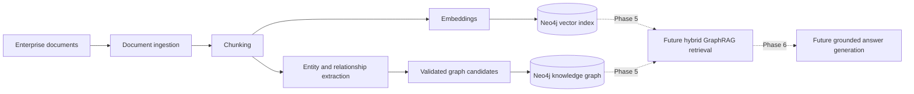
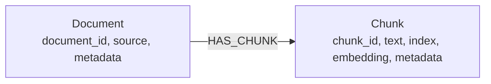
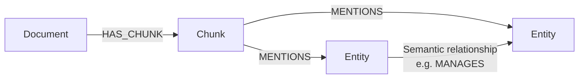

# Enterprise GraphRAG

A production-oriented foundation for building trustworthy question-answering systems over enterprise documents with knowledge graphs, semantic retrieval, and large language models.

## What is GraphRAG?

GraphRAG extends retrieval-augmented generation (RAG) with a knowledge graph. Traditional RAG retrieves text chunks by semantic similarity; GraphRAG can also follow explicit entities and relationships across documents. Combining both signals helps answer questions that require context, connections, and multi-hop reasoning while retaining links to the source material.

## Problem this project solves

Enterprise knowledge is fragmented across policies, reports, contracts, and internal documentation. Pure vector search can find similar passages but may miss relationships between people, systems, business units, and events. Enterprise GraphRAG is designed to ingest that content, represent its structure in Neo4j, retrieve relevant graph and vector context, and produce grounded answers with source citations.

Phases 1 through 4 are implemented: the project loads text, Markdown, and PDF documents, creates deterministic provenance-preserving chunks, generates OpenAI-compatible embeddings, performs semantic retrieval, extracts validated graph candidates, and constructs a queryable Neo4j knowledge graph. Hybrid retrieval and answer generation remain intentionally out of scope.

## Architecture



The codebase is organized by responsibility:

- `app/ingestion`: document loading, normalization, and chunking
- `app/embeddings`: provider-neutral OpenAI and Azure OpenAI embedding support
- `app/extraction`: structured LLM extraction, normalization, and validation
- `app/indexing`: embedding and Neo4j vector-index orchestration
- `app/graph`: Neo4j vector storage, knowledge-graph construction, and graph queries
- `app/retrieval`: graph, vector, and hybrid retrieval strategies
- `app/generation`: provider-neutral LLM orchestration and grounded responses
- `app/models`: API and domain models

## Technology stack

- Python 3.12
- FastAPI and Pydantic Settings
- Neo4j and `neo4j-graphrag`
- OpenAI/Azure OpenAI-compatible model clients
- Pytest
- Docker and Docker Compose

## Planned capabilities

- [x] Configurable `.txt`, `.md`, and `.pdf` document ingestion
- [x] Deterministic chunking with overlap and source provenance
- [x] OpenAI and Azure OpenAI-compatible embedding abstraction
- [x] Idempotent chunk persistence and vector indexing in Neo4j
- [x] Semantic vector retrieval API
- [x] Structured, provenance-aware entity and relationship extraction
- [x] Idempotent knowledge-graph construction and neighborhood queries in Neo4j
- Hybrid semantic and graph-aware retrieval
- Grounded answer generation with source citations
- Evaluation, observability, resilience, and expanded automated tests

## Local setup

### Prerequisites

- Python 3.12
- Docker with Docker Compose
- An OpenAI API key or Azure OpenAI deployment credentials

### Run with Docker Compose

1. Create a local environment file:

   ```bash
   cp .env.example .env
   ```

2. Add your own credentials to `.env`. Never commit that file.

3. Build and start the API and Neo4j:

   ```bash
   docker compose up --build
   ```

4. Check the API at `http://localhost:8000/health` and the Neo4j Browser at `http://localhost:7474`.

### Run the API locally

1. Create and activate a virtual environment.
2. Install the dependencies from `requirements.txt`.
3. Copy `.env.example` to `.env` and configure it.
4. Start the development server:

   ```bash
   uvicorn app.main:app --reload
   ```

Run the test suite with:

```bash
pytest
```

## Document ingestion

`DocumentLoader` normalizes supported source files into a shared `Document` model. It uses `pypdf` for PDF extraction and reports explicit errors for unsupported, empty, missing, unreadable, or malformed documents.

`TextChunker` produces stable character windows with configurable overlap. Every `DocumentChunk` includes its parent document ID, sequential index, source metadata, and character offsets, making the output suitable for both embedding and knowledge-graph pipelines.

Configure chunking in `.env`:

```dotenv
CHUNK_SIZE=1000
CHUNK_OVERLAP=200
```

The overlap must be non-negative and smaller than the chunk size. To process a document programmatically:

```python
from app.ingestion import DocumentIngestionPipeline

document, chunks = DocumentIngestionPipeline().ingest(
    "data/sample/information-security-policy.md"
)
```

## Embeddings and vector indexing

Phase 2 enriches the Phase 1 `DocumentChunk` records without changing their identity or provenance. `ChunkEmbeddingService` accepts a provider-neutral embedding interface, validates vector dimensions, and returns `EmbeddedChunk` records. The provider factory supports both OpenAI and Azure OpenAI-compatible embedding clients.

`Neo4jVectorStore` persists the following graph using idempotent `MERGE` operations:



The store creates uniqueness constraints and the configured Neo4j vector index only when necessary. If an existing index has a different dimension or similarity function, initialization fails with a clear configuration error instead of silently replacing it.

### Phase 2 configuration

```dotenv
EMBEDDING_PROVIDER=openai
EMBEDDING_DIMENSION=1536
OPENAI_API_KEY=replace-with-your-openai-api-key
OPENAI_EMBEDDING_MODEL=text-embedding-3-small

NEO4J_VECTOR_INDEX_NAME=chunk_embedding_index
VECTOR_SIMILARITY_FUNCTION=cosine
RETRIEVAL_TOP_K=5
```

For Azure OpenAI, set `EMBEDDING_PROVIDER=azure_openai` and configure `AZURE_OPENAI_API_KEY`, `AZURE_OPENAI_ENDPOINT`, `AZURE_OPENAI_API_VERSION`, and `AZURE_OPENAI_EMBEDDING_DEPLOYMENT`. The configured embedding dimension must match both the deployed model output and the Neo4j vector index.

### Index the sample document

The components can be composed directly without duplicating Phase 1 logic:

```python
from neo4j import GraphDatabase

from app.config import get_settings
from app.embeddings import ChunkEmbeddingService, create_embedding_provider
from app.graph import Neo4jVectorStore, VectorIndexConfig
from app.indexing import VectorIndexingPipeline
from app.ingestion import DocumentIngestionPipeline

settings = get_settings()
document, chunks = DocumentIngestionPipeline(settings=settings).ingest(
    "data/sample/information-security-policy.md"
)
provider = create_embedding_provider(settings)
driver = GraphDatabase.driver(
    settings.neo4j_uri,
    auth=(settings.neo4j_user, settings.neo4j_password.get_secret_value()),
)
store = Neo4jVectorStore(
    driver,
    settings.neo4j_database,
    VectorIndexConfig(
        settings.neo4j_vector_index_name,
        settings.embedding_dimension,
        settings.vector_similarity_function,
    ),
)
VectorIndexingPipeline(
    ChunkEmbeddingService(provider, settings.embedding_dimension),
    store,
).index(document, chunks)
driver.close()
```

This produces the complete Phase 2 flow:

```text
sample document → ingestion/chunking → embeddings → Neo4j vector storage → semantic retrieval
```

The example assumes `NEO4J_PASSWORD` is configured. Production applications should manage the driver lifecycle centrally and store secrets in a secret manager.

### Semantic retrieval

After indexing at least one document, retrieve relevant chunks without generating an LLM answer:

```bash
curl -X POST http://localhost:8000/retrieve/vector \
  -H "Content-Type: application/json" \
  -d '{"query":"What is the organization data retention policy?","top_k":5}'
```

The response contains scored chunks with `chunk_id`, `document_id`, text, similarity score, and source metadata. No production retrieval results are mocked or synthesized.

## Entity and relationship extraction

Phase 3 sends each Phase 1 `DocumentChunk` through a provider-neutral extraction interface. The OpenAI-compatible implementation uses Pydantic schema-constrained chat output, then a separate service normalizes, validates, and deduplicates the result. It never parses arbitrary LLM prose and does not require Neo4j.

The initial enterprise entity taxonomy is centralized in `EntityType`:

```text
PERSON, ORGANIZATION, BUSINESS_UNIT, LOCATION, SYSTEM, APPLICATION,
POLICY, REGULATION, PROCESS, PRODUCT, SERVICE, EVENT, DATE, CONCEPT, OTHER
```

Entity display names retain meaningful casing while identity keys use deterministic Unicode, whitespace, and case normalization. Relationship labels become `UPPER_SNAKE_CASE`. Familiar labels such as `MANAGES`, `PART_OF`, and `GOVERNED_BY` are encouraged, but precise new labels remain supported when the controlled examples would be inaccurate.

Every entity and relationship includes `document_id`, `chunk_id`, source filename or path, chunk index, and the original source metadata. Relationship evidence is retained when the provider supplies it. IDs are deterministic, duplicate candidates within a chunk are removed, and invalid endpoints, unknown entity types, conflicting duplicates, and self-references are rejected.

### Extraction provider configuration

Phase 3 reuses the existing LLM provider settings rather than introducing duplicate credentials:

```dotenv
LLM_PROVIDER=openai
OPENAI_API_KEY=replace-with-your-openai-api-key
OPENAI_CHAT_MODEL=gpt-4.1-mini
```

For Azure OpenAI, set `LLM_PROVIDER=azure_openai` and configure `AZURE_OPENAI_API_KEY`, `AZURE_OPENAI_ENDPOINT`, `AZURE_OPENAI_API_VERSION`, and `AZURE_OPENAI_CHAT_DEPLOYMENT`.

### Extract graph candidates

The extraction-only endpoint accepts text and optional source provenance:

```bash
curl -X POST http://localhost:8000/extract/graph \
  -H "Content-Type: application/json" \
  -d '{"text":"The Information Security Team manages the Identity Access System."}'
```

The response contains normalized entities, supported relationships, deterministic IDs, and provenance. It does not persist graph candidates. To process the sample policy through Phase 1 and Phase 3 programmatically:

```python
from app.config import get_settings
from app.extraction import GraphExtractionService, create_graph_extraction_provider
from app.ingestion import DocumentIngestionPipeline

settings = get_settings()
_, chunks = DocumentIngestionPipeline(settings=settings).ingest(
    "data/sample/information-security-policy.md"
)
service = GraphExtractionService(create_graph_extraction_provider(settings))
results = service.extract_chunks(chunks)
```

The likely concepts in the sample include policies, business functions, systems, processes, and their source-supported relationships. Actual results come from the configured model and are never hard-coded into production code. Phase 4 persists these candidates into the Neo4j knowledge graph as described below.

## Neo4j knowledge-graph construction

Phase 4 persists the validated Phase 3 candidates as a real knowledge graph while reusing the `Document` and `Chunk` nodes created by the Phase 2 vector branch.



### Graph schema and identity

- `Document.document_id`, `Chunk.chunk_id`, and `Entity.entity_id` have idempotent uniqueness constraints.
- Entities use a single `:Entity` label with `name`, `normalized_name`, `entity_type`, and an optional description.
- Entity identity is the SHA-256 hash of the controlled entity type and exact normalized name. It never includes document, chunk, extraction order, or provenance, so the same normalized entity from different documents resolves to the same node.
- This phase intentionally performs no fuzzy or semantic entity resolution.

### Provenance and evidence

Every source chunk creates one idempotent `(:Chunk)-[:MENTIONS]->(:Entity)` edge carrying the document ID, chunk ID and index, source path, and serialized source metadata. Provenance is not stored as a mutable singleton property on the Entity node.

Semantic relationships are merged by directed source entity, validated relationship type, and target entity. One semantic edge can therefore accumulate support from multiple chunks. Its `evidence_ids` and `evidence_records` arrays append each deterministic Phase 3 relationship evidence record only once, retaining descriptions, textual evidence, and complete source provenance for later citations.

All entities, mentions, and semantic relationships for one extraction are written in a single Neo4j transaction. Persistence first verifies that the referenced Phase 2 `Document-[:HAS_CHUNK]->Chunk` path exists; missing chunks abort the transaction rather than creating duplicate document or chunk nodes.

### Graph persistence API

Persist an already validated Phase 3 `ExtractionResult`:

```text
POST /graph/extractions
```

The endpoint accepts only the typed extraction schema. It never accepts Cypher. Relationship types must already be canonical `UPPER_SNAKE_CASE`; property values and IDs are sent as parameters, and only strictly validated relationship labels are interpolated into Cypher.

### Entity neighborhood API

Retrieve directly connected semantic entities and all supporting evidence:

```text
GET /graph/entities/{entity_id}/neighbors
```

The response preserves edge direction and contains the source entity, target entity, normalized relationship type, descriptions, evidence text, and document/chunk provenance. It is a focused graph query only—Phase 5 hybrid vector-plus-graph retrieval has not been implemented.

The complete graph-side sample workflow is:

```text
sample policy → chunks → structured extraction → validated candidates
              → Neo4j entities, mentions, semantic edges, and evidence
```

## API

| Method | Endpoint | Description |
| --- | --- | --- |
| `GET` | `/health` | Confirms that the API process is healthy |
| `POST` | `/retrieve/vector` | Returns semantically similar chunks from the Neo4j vector index |
| `POST` | `/extract/graph` | Extracts validated entities and relationships without persistence |
| `POST` | `/graph/extractions` | Persists one validated extraction transactionally |
| `GET` | `/graph/entities/{entity_id}/neighbors` | Returns direct semantic neighbors and supporting provenance |

## Security

Configuration is loaded from environment variables. Secrets belong only in a local `.env` file or a production secret manager; no credentials are stored in source control.

## Project status

This project is being developed incrementally, with each phase building on the previous one:

- [x] **Foundation:** FastAPI service, environment configuration, Neo4j container setup, health endpoint, and initial tests
- [x] **Phase 1 — Document ingestion and chunking:** TXT, Markdown, and PDF ingestion; deterministic overlapping chunks; source metadata preservation; and unit test coverage
- [x] **Phase 2 — Embeddings and vector indexing:** provider-neutral embeddings, idempotent Neo4j chunk storage, vector-index management, and semantic retrieval
- [x] **Phase 3 — Entity and relationship extraction:** structured LLM output, deterministic normalization, validation, deduplication, and source provenance
- [x] **Phase 4 — Neo4j knowledge-graph construction:** transactional entity, mention, semantic-edge, and evidence persistence with neighborhood queries
- [ ] **Phase 5 — Hybrid GraphRAG retrieval**
- [ ] **Phase 6 — Grounded answer generation and source citations**

Current milestone: **Phase 4 complete.**

## Author

**Alem Mekru**

AI Engineer | MSc Artificial Intelligence | Doctoral Researcher in Applied Artificial Intelligence

- GitHub: https://github.com/AlemMekru
- LinkedIn: https://www.linkedin.com/in/alemmekru/
