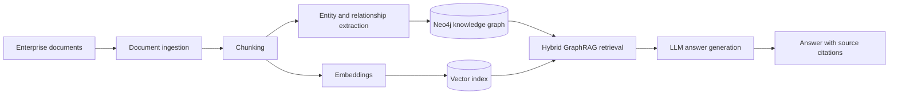

# Enterprise GraphRAG

A production-oriented foundation for building trustworthy question-answering systems over enterprise documents with knowledge graphs, semantic retrieval, and large language models.

## What is GraphRAG?

GraphRAG extends retrieval-augmented generation (RAG) with a knowledge graph. Traditional RAG retrieves text chunks by semantic similarity; GraphRAG can also follow explicit entities and relationships across documents. Combining both signals helps answer questions that require context, connections, and multi-hop reasoning while retaining links to the source material.

## Problem this project solves

Enterprise knowledge is fragmented across policies, reports, contracts, and internal documentation. Pure vector search can find similar passages but may miss relationships between people, systems, business units, and events. Enterprise GraphRAG is designed to ingest that content, represent its structure in Neo4j, retrieve relevant graph and vector context, and produce grounded answers with source citations.

Phase 1 is implemented: the project can load text, Markdown, and PDF documents and split them into deterministic, provenance-preserving chunks. Embeddings, graph construction, entity extraction, retrieval, and answer generation remain intentionally out of scope for this phase.

## Architecture



The codebase is organized by responsibility:

- `app/ingestion`: document loading, normalization, and chunking
- `app/graph`: entity extraction, graph persistence, and Neo4j access
- `app/retrieval`: graph, vector, and hybrid retrieval strategies
- `app/generation`: provider-neutral LLM orchestration and grounded responses
- `app/models`: API and domain models

## Technology stack

- Python 3.12
- FastAPI and Pydantic Settings
- Neo4j and `neo4j-graphrag`
- OpenAI/Azure OpenAI-compatible model clients
- Pytest
- Docker and Docker Compose

## Planned capabilities

- [x] Configurable `.txt`, `.md`, and `.pdf` document ingestion
- [x] Deterministic chunking with overlap and source provenance
- Structured entity and relationship extraction
- Idempotent knowledge-graph construction in Neo4j
- Embedding generation and Neo4j vector indexes
- Hybrid semantic and graph-aware retrieval
- OpenAI and Azure OpenAI provider abstraction
- Grounded answer generation with source citations
- Evaluation, observability, resilience, and expanded automated tests

## Local setup

### Prerequisites

- Python 3.12
- Docker with Docker Compose
- An OpenAI API key or Azure OpenAI deployment credentials

### Run with Docker Compose

1. Create a local environment file:

   ```bash
   cp .env.example .env
   ```

2. Add your own credentials to `.env`. Never commit that file.

3. Build and start the API and Neo4j:

   ```bash
   docker compose up --build
   ```

4. Check the API at `http://localhost:8000/health` and the Neo4j Browser at `http://localhost:7474`.

### Run the API locally

1. Create and activate a virtual environment.
2. Install the dependencies from `requirements.txt`.
3. Copy `.env.example` to `.env` and configure it.
4. Start the development server:

   ```bash
   uvicorn app.main:app --reload
   ```

Run the test suite with:

```bash
pytest
```

## Document ingestion

`DocumentLoader` normalizes supported source files into a shared `Document` model. It uses `pypdf` for PDF extraction and reports explicit errors for unsupported, empty, missing, unreadable, or malformed documents.

`TextChunker` produces stable character windows with configurable overlap. Every `DocumentChunk` includes its parent document ID, sequential index, source metadata, and character offsets, making the output suitable for both embedding and knowledge-graph pipelines.

Configure chunking in `.env`:

```dotenv
CHUNK_SIZE=1000
CHUNK_OVERLAP=200
```

The overlap must be non-negative and smaller than the chunk size. To process a document programmatically:

```python
from app.ingestion import DocumentIngestionPipeline

document, chunks = DocumentIngestionPipeline().ingest(
    "data/sample/information-security-policy.md"
)
```

## API

| Method | Endpoint | Description |
| --- | --- | --- |
| `GET` | `/health` | Confirms that the API process is healthy |

## Security

Configuration is loaded from environment variables. Secrets belong only in a local `.env` file or a production secret manager; no credentials are stored in source control.

## Project status

This project is being developed incrementally, with each phase building on the previous one:

- [x] **Foundation:** FastAPI service, environment configuration, Neo4j container setup, health endpoint, and initial tests
- [x] **Phase 1 — Document ingestion and chunking:** TXT, Markdown, and PDF ingestion; deterministic overlapping chunks; source metadata preservation; and unit test coverage
- [ ] **Phase 2 — Embeddings and vector indexing**
- [ ] **Phase 3 — Entity and relationship extraction**
- [ ] **Phase 4 — Neo4j knowledge-graph construction**
- [ ] **Phase 5 — Hybrid GraphRAG retrieval**
- [ ] **Phase 6 — Grounded answer generation and source citations**

Current milestone: **Phase 1 complete.**

## Author

**Alem Mekru**

AI Engineer | MSc Artificial Intelligence | Doctoral Researcher in Applied Artificial Intelligence

- GitHub: https://github.com/AlemMekru
- LinkedIn: https://www.linkedin.com/in/alemmekru/
