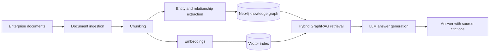

# Enterprise GraphRAG

A production-oriented foundation for building trustworthy question-answering systems over enterprise documents with knowledge graphs, semantic retrieval, and large language models.

## What is GraphRAG?

GraphRAG extends retrieval-augmented generation (RAG) with a knowledge graph. Traditional RAG retrieves text chunks by semantic similarity; GraphRAG can also follow explicit entities and relationships across documents. Combining both signals helps answer questions that require context, connections, and multi-hop reasoning while retaining links to the source material.

## Problem this project solves

Enterprise knowledge is fragmented across policies, reports, contracts, and internal documentation. Pure vector search can find similar passages but may miss relationships between people, systems, business units, and events. Enterprise GraphRAG is designed to ingest that content, represent its structure in Neo4j, retrieve relevant graph and vector context, and produce grounded answers with source citations.

This repository currently contains the professional project foundation. The ingestion and GraphRAG pipeline components are intentionally not implemented yet.

## Architecture



The codebase is organized by responsibility:

- `app/ingestion`: document loading, normalization, and chunking
- `app/graph`: entity extraction, graph persistence, and Neo4j access
- `app/retrieval`: graph, vector, and hybrid retrieval strategies
- `app/generation`: provider-neutral LLM orchestration and grounded responses
- `app/models`: API and domain models

## Technology stack

- Python 3.12
- FastAPI and Pydantic Settings
- Neo4j and `neo4j-graphrag`
- OpenAI/Azure OpenAI-compatible model clients
- Pytest
- Docker and Docker Compose

## Planned capabilities

- Configurable enterprise document ingestion and chunking
- Structured entity and relationship extraction
- Idempotent knowledge-graph construction in Neo4j
- Embedding generation and Neo4j vector indexes
- Hybrid semantic and graph-aware retrieval
- OpenAI and Azure OpenAI provider abstraction
- Grounded answer generation with source citations
- Evaluation, observability, resilience, and expanded automated tests

## Local setup

### Prerequisites

- Python 3.12
- Docker with Docker Compose
- An OpenAI API key or Azure OpenAI deployment credentials

### Run with Docker Compose

1. Create a local environment file:

   ```bash
   cp .env.example .env
   ```

2. Add your own credentials to `.env`. Never commit that file.

3. Build and start the API and Neo4j:

   ```bash
   docker compose up --build
   ```

4. Check the API at `http://localhost:8000/health` and the Neo4j Browser at `http://localhost:7474`.

### Run the API locally

1. Create and activate a virtual environment.
2. Install the dependencies from `requirements.txt`.
3. Copy `.env.example` to `.env` and configure it.
4. Start the development server:

   ```bash
   uvicorn app.main:app --reload
   ```

Run the test suite with:

```bash
pytest
```

## API

| Method | Endpoint | Description |
| --- | --- | --- |
| `GET` | `/health` | Confirms that the API process is healthy |

## Security

Configuration is loaded from environment variables. Secrets belong only in a local `.env` file or a production secret manager; no credentials are stored in source control.

## Project status

Foundation phase. The service shell, configuration model, container setup, and health test are ready for incremental GraphRAG implementation.

## Author

**Alem Mekru**

AI Engineer | MSc Artificial Intelligence | Doctoral Researcher in Applied Artificial Intelligence

- GitHub: https://github.com/AlemMekru
- LinkedIn: https://www.linkedin.com/in/alemmekru/
